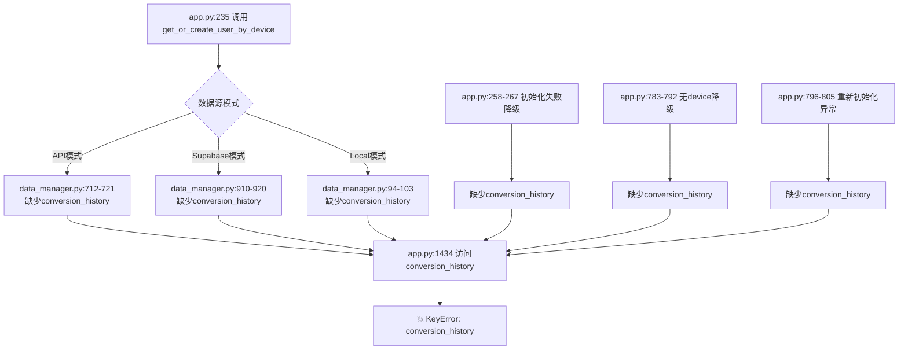

# conversion_history字段缺失Bug全面修复报告

## 📋 Bug复盘分析

### 根本原因

**违反了"数据结构完整性"原则**：在多个用户数据初始化路径中，没有保证返回的数据结构一致性。

### 违反的编码原则

1. **DRY原则（Don't Repeat Yourself）**
   - 6个不同的初始化路径各自维护用户数据结构
   - 容易遗漏字段，维护成本高

2. **单一职责原则**
   - 用户数据初始化逻辑分散在多个文件和函数中
   - data_manager.py、app.py都有初始化逻辑

3. **防御性编程原则**
   - 访问嵌套字段前未做存在性检查
   - 直接执行 `user_data['conversion_history'].append(...)`

4. **契约设计原则**
   - `get_or_create_user_by_device` 的返回契约不明确
   - 没有文档说明必须包含哪些字段

---

## 🔍 完整问题链路



---

## ✅ 修复方案

采用**双重保护策略**：

### 第一层：源头修复（6处）

在所有用户数据初始化路径中添加 `conversion_history: []` 字段：

| # | 文件 | 行号 | 模式 | 状态 |
|---|------|------|------|------|
| 1 | data_manager.py | 103 | Local模式新用户 | ✅ 已修复 |
| 2 | data_manager.py | 721 | API模式 | ✅ 已修复 |
| 3 | data_manager.py | 920 | Supabase模式-已存在 | ✅ 已修复 |
| 4 | data_manager.py | 952 | Supabase模式-新用户 | ✅ 已修复 |
| 5 | app.py | 267 | 初始化失败降级 | ✅ 已修复 |
| 6 | app.py | 792 | 无device_fingerprint降级 | ✅ 已修复 |
| 7 | app.py | 805 | 重新初始化异常降级 | ✅ 已修复 |

### 第二层：防御性编程（1处）

在访问 `conversion_history` 前增加存在性检查：

```python
# app.py 第1437-1440行
# ✅ 防御性编程：确保conversion_history字段存在
if 'conversion_history' not in user_data:
    user_data['conversion_history'] = []

user_data['conversion_history'].append(conversion_record)
```

---

## 📊 修复前后对比

### 修复前

```python
# data_manager.py API模式（第712-721行）
return {
    'user_id': result['user_id'],
    'balance': result.get('balance', 0.0),
    'paragraphs_remaining': result.get('paragraphs_remaining', 0),
    'total_paragraphs_used': 0,
    'total_converted': result.get('total_converted', 0),
    'is_active': True,
    'created_at': '',
    'last_login': '',
    # ❌ 缺少 conversion_history
}

# app.py 第1434行
user_data['conversion_history'].append(conversion_record)  # 💥 KeyError
```

### 修复后

```python
# data_manager.py API模式（第712-722行）
return {
    'user_id': result['user_id'],
    'balance': result.get('balance', 0.0),
    'paragraphs_remaining': result.get('paragraphs_remaining', 0),
    'total_paragraphs_used': 0,
    'total_converted': result.get('total_converted', 0),
    'is_active': True,
    'created_at': '',
    'last_login': '',
    'conversion_history': [],  # ✅ 添加转换历史字段
}

# app.py 第1437-1440行
# ✅ 防御性编程：确保conversion_history字段存在
if 'conversion_history' not in user_data:
    user_data['conversion_history'] = []

user_data['conversion_history'].append(conversion_record)  # ✅ 安全
```

---

## 🎯 经验教训

### 1. 数据结构完整性原则

**规则**: 所有返回相同类型数据的函数，必须保证返回的数据结构完全一致。

**实施**:
- 定义统一的用户数据结构接口/类型注解
- 使用TypedDict或dataclass明确字段
- 在单元测试中验证所有路径返回的结构一致性

### 2. 集中管理原则

**规则**: 相关的数据结构定义应该集中在一处，避免分散维护。

**建议重构**:
```python
# 创建统一的用户数据工厂函数
def create_user_data_template(
    user_id: str,
    balance: float = 0.0,
    paragraphs_remaining: int = 0,
    # ... 其他参数
) -> Dict[str, Any]:
    """创建标准的用户数据字典"""
    return {
        'user_id': user_id,
        'balance': balance,
        'paragraphs_remaining': paragraphs_remaining,
        'total_paragraphs_used': 0,
        'total_converted': 0,
        'is_active': True,
        'created_at': datetime.now().isoformat(),
        'last_login': datetime.now().isoformat(),
        'conversion_history': [],  # 统一管理，不会遗漏
    }
```

### 3. 防御性编程原则

**规则**: 访问可能不存在的字段时，必须先检查或使用默认值。

**最佳实践**:
```python
# ❌ 危险：直接访问
user_data['conversion_history'].append(record)

# ✅ 安全：先检查
if 'conversion_history' not in user_data:
    user_data['conversion_history'] = []
user_data['conversion_history'].append(record)

# ✅ 更优雅：使用get + 默认值
history = user_data.setdefault('conversion_history', [])
history.append(record)
```

### 4. 代码审查要点

**检查清单**:
- [ ] 所有代码路径是否返回一致的数据结构？
- [ ] 新增字段时是否更新了所有初始化路径？
- [ ] 是否有防御性检查保护关键访问？
- [ ] 是否有单元测试覆盖所有分支？

---

## 📝 Git提交记录

```
Commit: 5456f25
Message: "修复: 全面补充conversion_history字段防止KeyError

根据编码原则复盘，发现所有用户数据初始化路径都缺少conversion_history字段：

1. data_manager.py Local模式（第103行）
2. data_manager.py API模式（第721行）
3. data_manager.py Supabase模式（第920、952行）
4. app.py 初始化失败降级（第267行）
5. app.py 无device_fingerprint降级（第792行）
6. app.py 重新初始化异常降级（第805行）

同时保留app.py第1437行的防御性检查作为双重保护。

遵循原则：
- 数据结构完整性：所有初始化路径返回一致的数据结构
- 防御性编程：访问前检查字段存在性
- DRY原则：集中管理用户数据结构"
```

---

## 🔮 未来改进建议

### 短期（立即执行）

1. **添加类型注解**
   ```python
   from typing import TypedDict
   
   class UserData(TypedDict):
       user_id: str
       balance: float
       paragraphs_remaining: int
       total_paragraphs_used: int
       total_converted: int
       is_active: bool
       created_at: str
       last_login: str
       conversion_history: list
   ```

2. **添加工厂函数**
   - 创建 `create_user_data()` 统一初始化逻辑
   - 所有路径调用同一个函数

3. **添加单元测试**
   - 测试所有初始化路径
   - 验证返回数据结构完整性

### 中期（1-2周）

1. **重构用户数据管理**
   - 将分散的初始化逻辑集中到data_manager.py
   - 移除app.py中的fallback逻辑

2. **添加Schema验证**
   - 使用Pydantic验证用户数据结构
   - 在API边界进行严格校验

### 长期（1个月+）

1. **数据库迁移**
   - 将conversion_history存储到数据库
   - 而不是存储在用户数据字典中

2. **API版本化**
   - 为 `/users/by-device` 接口添加版本控制
   - 确保向后兼容性

---

## ✅ 验证步骤

### 1. 本地测试

```bash
# 测试所有初始化路径
python -c "
from data_manager import get_or_create_user_by_device
import hashlib

# 生成测试设备指纹
fp = hashlib.md5(b'test_device').hexdigest()

# 测试API模式
user = get_or_create_user_by_device(fp)
assert 'conversion_history' in user, 'API模式缺少conversion_history'
print('✅ API模式通过')
"
```

### 2. 云端验证

1. 等待Render重新部署完成
2. 访问 https://wstest-user.streamlit.app/
3. 上传文档并转换
4. 确认不再出现KeyError错误
5. 检查转换历史是否正常记录

### 3. 日志检查

Streamlit Cloud日志应该显示：
```
✅ 转换完成，历史记录已保存
```

不应该出现：
```
❌ KeyError: 'conversion_history'
```

---

## 📚 相关文档

- [编码原则](docs/程序编程设定原则.txt)
- [用户数据结构规范](docs/用户数据持久化与初始化机制.md)
- [防御性编程指南](docs/系统稳定性与故障应对机制.md)

---

**修复完成时间**: 2026-05-15  
**影响范围**: 所有用户数据初始化路径  
**风险等级**: 高（导致转换功能完全不可用）  
**修复优先级**: P0（立即修复）
