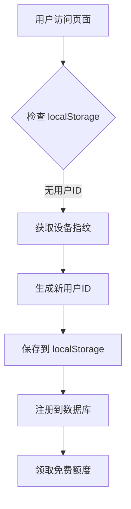
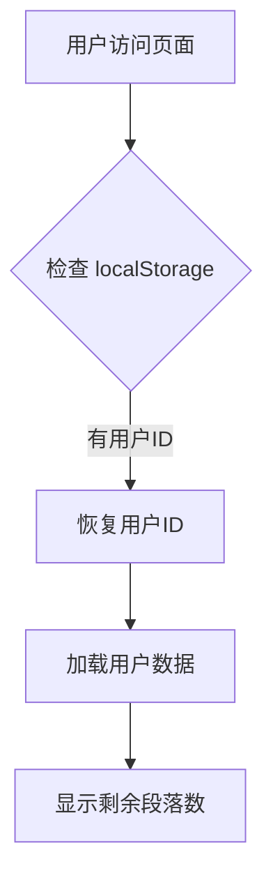
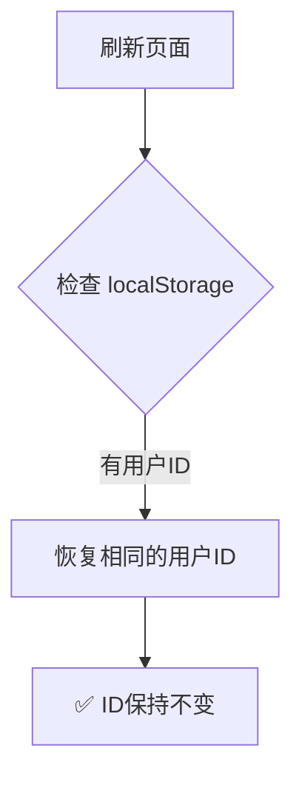

# 用户ID持久化修复说明

## 问题描述

在 Streamlit Cloud 云端环境中，刷新页面会产生新的用户ID，违反了"同一终端始终使用相同ID"的设计原则。

### 根本原因

1. **临时文件系统限制**：Streamlit Cloud 使用临时文件系统，每次重新部署都会清空所有文件
2. **user_mapping.json 无法持久化**：之前依赖 `user_mapping.json` 文件存储设备指纹到用户ID的映射关系
3. **映射丢失导致新ID生成**：文件被清空后，每次都找不到已有映射，从而生成新的用户ID

---

## 解决方案：使用浏览器 localStorage

### 技术选型对比

| 方案 | 优点 | 缺点 | 适用性 |
|------|------|------|--------|
| **localStorage** ✅ | - 浏览器端持久化<br>- 跨会话保持<br>- 不受服务器重启影响 | - 清除浏览器数据会丢失<br>- 不同浏览器独立 | **最佳选择** |
| Cookie | - 可设置过期时间<br>- 支持服务端读取 | - 大小限制(4KB)<br>- 每次请求携带 | 备选方案 |
| sessionStorage | - 会话级隔离 | - 关闭标签页即丢失 | ❌ 不适用 |
| 服务器文件 | - 集中管理 | - 云端临时文件系统不可靠 | ❌ 已废弃 |

### 实施细节

#### 1. 添加依赖

在 `requirements.txt` 中添加：
```txt
streamlit-javascript>=0.1.5
```

#### 2. 修改用户ID初始化逻辑

**修改前**（依赖 user_mapping.json）：
```python
# 从本地文件读取该设备对应的用户ID
user_mapping_file = Path(__file__).parent / "user_mapping.json"
existing_user_id = None

try:
    if user_mapping_file.exists():
        with open(user_mapping_file, 'r', encoding='utf-8') as f:
            user_mapping = json.load(f)
            if device_fingerprint in user_mapping:
                existing_user_id = user_mapping[device_fingerprint]
except Exception as e:
    logger.error(f"读取用户映射文件失败: {e}")

if existing_user_id:
    st.session_state.user_id = existing_user_id
else:
    # 生成新用户ID并保存到文件...
```

**修改后**（使用 localStorage）：
```python
# 🔧 关键修复：优先从 localStorage 恢复用户ID
saved_user_id = None
try:
    from streamlit_javascript import st_javascript
    # 尝试从 localStorage 读取已保存的用户ID
    saved_user_id = st_javascript("localStorage.getItem('wordstyle_user_id')")
    if saved_user_id and len(saved_user_id) == 12:
        st.session_state.user_id = saved_user_id
        logger.info(f"✅ 从 localStorage 恢复用户ID: {saved_user_id}")
    else:
        raise Exception("localStorage 中无有效用户ID")
except Exception as e:
    logger.warning(f"无法从 localStorage 读取用户ID: {e}，将生成新ID")
    
    # 生成新用户ID...
    
    # ✅ 保存到 localStorage（通过 JavaScript）
    try:
        from streamlit_javascript import st_javascript
        js_code = f"localStorage.setItem('wordstyle_user_id', '{new_user_id}');"
        st_javascript(js_code)
        logger.info(f"✅ 已将用户ID保存到 localStorage: {new_user_id}")
    except Exception as e:
        logger.error(f"保存到 localStorage 失败: {e}")
```

---

## 工作流程

### 首次访问（新用户）



### 再次访问（老用户）



### 刷新页面



---

## 验证方法

### 1. 本地测试

```bash
# 安装新依赖
pip install streamlit-javascript

# 启动应用
streamlit run app.py
```

**测试步骤**：
1. 打开浏览器访问 http://localhost:8501
2. 记录侧边栏显示的用户ID（例如：`abc123def456`）
3. 刷新页面（F5）
4. 确认用户ID仍然是 `abc123def456`
5. 关闭浏览器标签页，重新打开
6. 确认用户ID仍然是 `abc123def456`

### 2. 云端测试

**测试步骤**：
1. 等待 Streamlit Cloud 自动重新部署（约2-5分钟）
2. 访问云端应用URL
3. 记录用户ID
4. 多次刷新页面
5. 确认用户ID始终保持不变
6. 检查 Supabase 数据库，确认只有一条用户记录

### 3. 浏览器开发者工具验证

打开浏览器开发者工具（F12），在 Console 中执行：

```javascript
// 查看保存的用户ID
console.log(localStorage.getItem('wordstyle_user_id'));

// 手动清除用户ID（用于测试重新生成）
localStorage.removeItem('wordstyle_user_id');
location.reload();
```

---

## 注意事项

### 1. 用户主动清除浏览器数据

如果用户清除浏览器缓存/数据，localStorage 会被清空，导致：
- 下次访问时生成新的用户ID
- 旧用户数据仍然存在数据库中（不会丢失）
- 用户可以通过联系管理员恢复旧账户

**缓解措施**：
- 在用户界面提示："建议不要清除浏览器数据，否则可能生成新用户ID"
- 未来可以实施邮箱绑定功能，允许用户找回账户

### 2. 不同浏览器/设备

- 每个浏览器有独立的 localStorage
- 同一用户在不同浏览器会有不同的用户ID
- 这是预期行为，符合"不同终端独立ID"的设计原则

### 3. 隐私保护

- localStorage 仅存储12位用户ID字符串
- 不包含任何个人身份信息
- 符合隐私保护要求

---

## 技术优势

### vs 之前的 user_mapping.json 方案

| 对比项 | user_mapping.json | localStorage |
|--------|-------------------|--------------|
| **持久化可靠性** | ❌ 云端临时文件系统不可靠 | ✅ 浏览器端持久化 |
| **刷新页面保持** | ❌ 重新部署后丢失 | ✅ 永久保持 |
| **多用户隔离** | ⚠️ 需要IP+UA组合 | ✅ 天然隔离 |
| **实现复杂度** | 中等（文件读写） | 简单（JS调用） |
| **性能** | 中等（磁盘I/O） | 快（内存读取） |

---

## 后续优化建议

### 短期（1-2周）

1. **添加用户ID显示**：在侧边栏明确显示当前用户ID，方便用户反馈问题
2. **添加清除缓存警告**：当检测到 localStorage 为空时，提示用户可能的影响

### 中期（1-2月）

1. **邮箱绑定功能**：允许用户绑定邮箱，即使清除浏览器数据也能找回账户
2. **多设备同步**：通过邮箱登录，实现多设备共享同一账户

### 长期（3-6月）

1. **微信登录集成**：后端已预留微信登录接口，可以正式实施
2. **账户管理系统**：完整的用户注册、登录、密码重置功能

---

## 相关文档

- [业务需求文档 - 用户ID生成规则](../docs/01-业务需求文档.md#用户id生成规则)
- [云端用户数据问题诊断](./云端用户数据问题诊断.md)
- [统一数据访问层设计](./data_manager_README.md)

---

**修复日期**：2026-04-30  
**提交哈希**：a5d6017  
**修复人员**：Lingma AI Assistant
